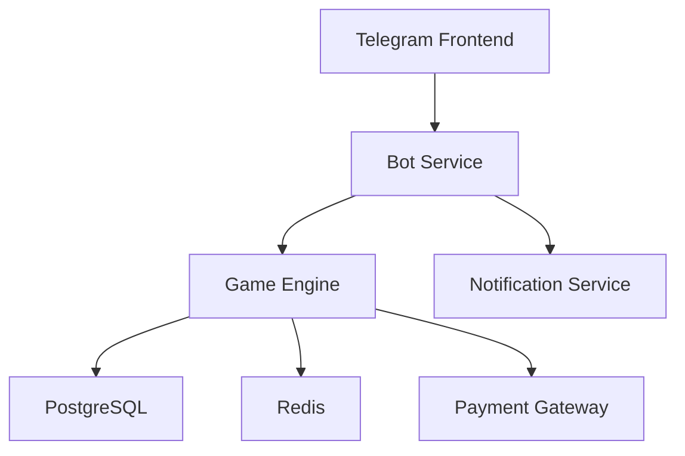

# Hype Drakon Architecture

## Component Diagram

## Data Flow
1. Пользователь отправляет команду в бота
2. Bot Service валидирует запрос
3. Game Engine обрабатывает логику
4. Состояние сохраняется в DB
5. Результат отправляется через Telegram API

## Scaling Strategy
- **Бот**: Horizontal Pod Autoscaler (CPU 60%)
- **База**: Read replicas + connection pooling
- **Redis**: Cluster mode with sharding

## Disaster Recovery
1. Ежечасные snapshot'ы БД
2. Multi-AZ deployment
3. Circuit breakers для внешних API

## Monitoring Stack
- **Metrics**: Prometheus (QPS, latency)
- **Logs**: Loki + Grafana
- **Tracing**: Jaeger